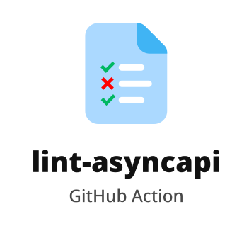

<p align="center">
  
</p>

🔥 **Latest stable version**: v1.0 ([Florence](https://en.wikipedia.org/wiki/Florence) Edition)

🤔 For **questions** use [discussions page](https://github.com/ingka-group-digital/lint-asyncapi/discussions)

📃 For **new feature requests and bug reports** use [issues page](https://github.com/ingka-group-digital/lint-asyncapi/issues)

🙌 **Join our community on [#cop-api-standards](https://ingka.slack.com/archives/C0485JDACH1) channel!**

---

## How to use it?

### As a GitHub action

Add the following step to your GitHub workflow job:

> **_Recommendation:_** run it before publishing the API to Kong API Gateway

```yaml
- uses: ingka-group-digital/lint-asyncapi@v1
    with:
      files: |
        <file-1-path>
        <file-2-path>
```

### As a GitHub workflow

You can create a separate GitHub workflow to lint-asyncapi spec files:

> **_Recommendation:_** run it whenever a new change in the spec files is pushed

```yaml
name: Lint AsyncAPI files

on:
  workflow_dispatch:
  push:
    paths:
      - <spec-files-path>

jobs:
  lint-asyncapi:
    runs-on: ubuntu-latest
    steps:
      - name: Checkout repository
        uses: actions/checkout@v3

      - name: Lint AsyncAPI specifications
        uses: ingka-group-digital/lint-asyncapi@v1
        with:
          files: |
            <file-1-path>
            <file-2-path>
```

## What is it?

`lint-asyncapi` is a GitHub action that helps you find problems with your AsyncAPI specification and ensure that it follows [INGKA API standards](https://github.com/ingka-group-digital/api-standards/blob/main/docs/EventAPI/README.md) maintained by API Management team.

## Why you need it?

- to make sure your AsyncAPI spec file follows [INGKA API standards](https://github.com/ingka-group-digital/api-standards/blob/main/docs/EventAPI/README.md);
- to automate AsyncAPI linting as part of your CI/CD pipeline;

## How it works?

TBD

## Which rules are used in this action?

TBD

## How to add and configure existing rules?

TBD

## How to create custom rules?

TBD

### :key: dependabot

By default, this action uses the `dependabot`

As described in the [official GitHub documentation](https://github.com/dependabot/dependabot-core):

> When you use the repository's dependabot finds and fixes vulnerabilities in your dependencies

### :key: release drafter

By default, this action uses the `release drafter`

As described in the [official GitHub documentation](https://github.com/marketplace/actions/release-drafter):

> When you use the repository's release drafter automatically creates a draft release on merge to main

### :pray: If you would like to contribute ?

1. Start a `discussion`
2. Create an `issue` with `feature request` or `bug` label
3. Clone and branch out
4. Push and create a PR

[Please follow this link to know more](https://github.com/ingka-group-digital/lint-asyncapi)
